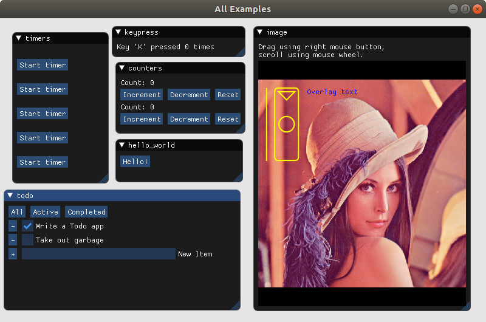

<h1 align="center">
  Python Concur
</h1>

<p align="center">
   
</p>

Concur is a Python UI framework based on synchronous generators.

It is a port of [Concur for Haskell](https://github.com/ajnsit/concur) and [Concur for Purescript](https://github.com/ajnsit/purescript-concur).

Concur can be thought of as a layer on top of [PyImGui](https://github.com/swistakm/pyimgui), which is a set of bindings for the [ImGui](https://github.com/ocornut/imgui) UI library. It helps you to get rid of unprincipled code with mutable state, and lets you build structured and composable abstractions.

A discussion of Concur concepts can also be found in the [Documentation for the Haskell/Purescript versions](https://github.com/ajnsit/concur-documentation/blob/master/README.md). This obviously uses Haskell/Purescript syntax and semantics, but many of the concepts will apply to the Python version.

Being an abstraction over ImGui, Concur is best used for debugging, prototyping and data analysis, rather than user-facing applications.



## Sample Code

Code samples can be found in the [examples directory](examples).

## Usage

Clone and install a PyImGui fork:

```sh
git clone git@github.com:potocpav/pyimgui.git --recurse-submodules
cd pyimgui
pip install -e.[glfw] --user
cd ..
```

Clone and install the Concur repo:

```sh
git clone git@github.com:potocpav/python-concur.git
cd python-concur
pip install -e. --user
```

Run the examples:

```sh
python examples/all.py
```

## Introduction

UI components in Concur are represented by generators, henceforth called **widgets**. Internally, widgets do three things:

* Call ImGui commands to draw stuff to screen
* When the drawing is done, `yield` and pass control flow upstream
* On user interaction, they `return result`, where result is a value representing user action and/or widget state.

A simple button widget can be implemented as follows:

```python
def button(text):
    while True:
        is_pressed = imgui.button(text): # Draw the button
        if is_pressed:
            return 123  # Return an arbitrary value
        yield           # Drawing is done.
```

The resulting widget can be displayed using `yield from`, optionally collecting its return value.

```python
value = yield from button("Click me")
assert value == 123
```

This shows the most interesting property of Concur: **widgets in exist only until they are interacted with.** This enables trivial composition in time by simply chaining the statements. There must be a `yield` between the buttons to properly clear the screen.

```python
yield from button("One Button")
yield
yield from button("Another Button")
```

This creates one button, and after it is clicked, another button is created. If the code above isn't in a loop or in another widget (see below), there is nothing more to do after clicking the second button and the application is closed.

Composition in space (that is, rendering multiple widgets at once) is done using the `concur.orr` combinator. The result of the composition is yet another widget:

```python
pair = concur.orr([button("First"), button("Second")])
yield from pair # display `pair` as a normal widget
```

The result of `concur.orr`  is returned as soon as any child widget returns, passing the return value along. How can we tell which button was pressed? We can't, they must simply return different values. In fact, buttons in Concur normally return their identifier instead of `None` to be readily composable. By convention, primitive widgets return a tuple `(identifier, value)`. For example, built-in buttons can be composed like this:

```python
pair = concur.orr([concur.button("First"), concur.button("Second")])
if pair == "First", _:
    print("first!")
if pair == "Second", _:
    print("second!")
```

Note that containers (such as a window) are widgets too, with the same semantics. They take as an argument a list of other widgets that will be drawn inside.

That's it for now. Play around with it. You will discover that these handful of concepts go a *long* way, and can be used to create even large UIs in a straightforward and clear manner. As a starting point, you can use the [examples](examples).


## Quirks and Issues

Here's a list of known issues and their solutions:

**Widget flicker**

Between any two `yield from _` statements that can return, there must be a `yield` statement. Otherwise, elements may get duplicated in a frame after triggering an action. If there are too many `yield` statemets, however, elements may momentarily disappear.

I don't think this bit of syntactic inconvenience can be solved without introducing other quirks.

**Event congestion**

On each frame, at most one action can get triggered from an `orr` block. Actions from first sub-widgets are prioritized, and any actions from further sub-widgets may get thrown out. This is a problem when there are rapidly-firing widgets, such as video playback. Move it down the `orr` block to decrease the priority.

This limitation can be lifted by changing the widgets to return lists of actions instead of only one action. It would make the API a bit uglier though, so I am not sold on the idea. If you have a better solution, or your use-case necessitates such change, file an issue.

**Asynchronous computations**

In other versions of Concur, all widgets are triggered asynchronously. This may not be possible in Python, due to a limitation of async generators: they can't `return`, they only `yield`. Synchronous generators are used instead, which means that all widget code is run in the main thread. Asynchronous code must be explicitly run in a background thread, which is easily achieved by passing a future into the `block` function. See the [timers example](examples/timers.py) for details.
