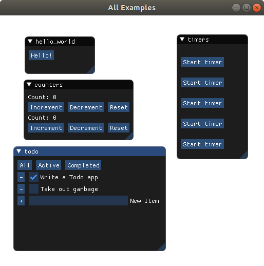

Concur for Python
=================

Concur is a Python UI framework based on synchronous generators.

It is a port of [Concur for Haskell](https://github.com/ajnsit/concur) and [Concur for Purescript](https://github.com/ajnsit/purescript-concur).

Concur can be thought of as a layer on top of [PyImGui](https://github.com/swistakm/pyimgui), which is a set of bindings for the [ImGui](https://github.com/ocornut/imgui) UI library. It helps you to get rid of unprincipled code with mutable state, and lets you build structured and composable abstractions.

A discussion of Concur concepts can also be found in the [Documentation for the Haskell/Purescript versions](https://github.com/ajnsit/concur-documentation/blob/master/README.md). This obviously uses Haskell/Purescript syntax and semantics, but many of the concepts will apply to the Python version.

Being an abstraction over ImGui, Concur is best used for debugging, prototyping and data analysis, rather than user-facing applications.

Contents
========

.. toctree::
   :maxdepth: 2

   reference/modules

Indices and tables
==================

* :ref:`genindex`
* :ref:`modindex`
* :ref:`search`
